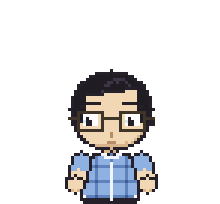
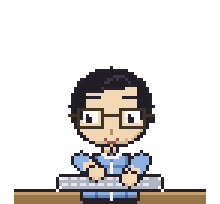
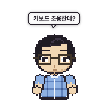
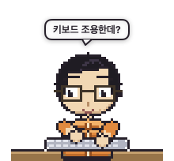
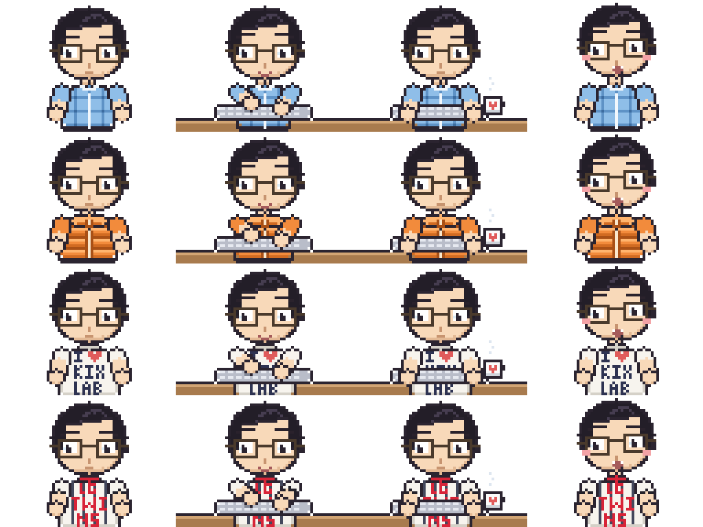
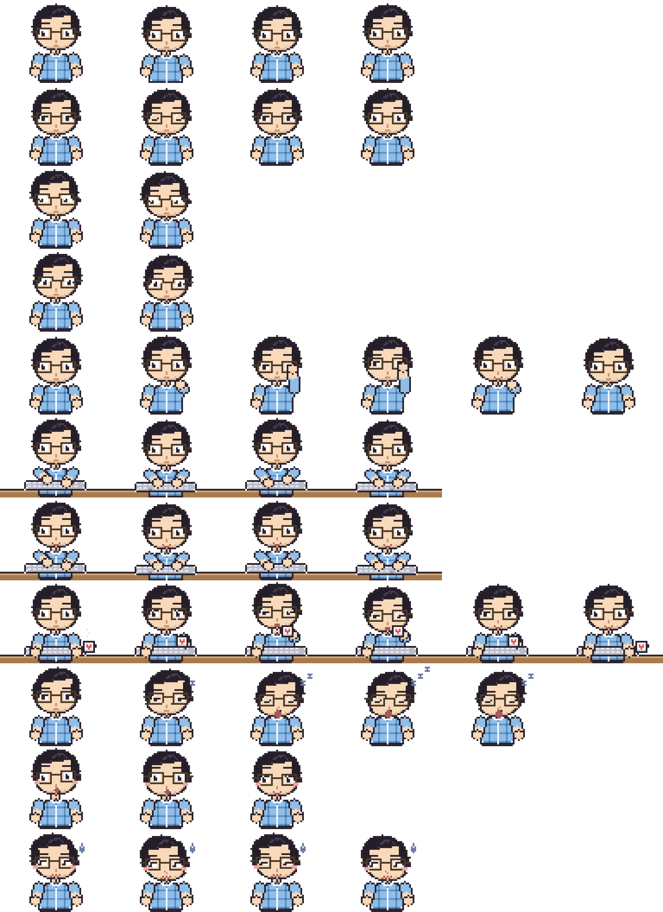

<div align="center">


# DeskPet 🐧

**A tiny pixel-art desktop pet for macOS**

It types along when you type, follows your cursor with its eyes,
and occasionally sips coffee or dozes off and wakes up startled.

**English** · [한국어](README.ko.md)

[](https://github.com/chaeyeon-2/DeskPet/actions/workflows/ci.yml)
[](LICENSE)







</div>

## Install

Grab the latest `.dmg` from **[Releases](https://github.com/chaeyeon-2/DeskPet/releases/latest)**,
drag DeskPet into Applications, then **right-click → Open** the first time
(it's ad-hoc signed, so a plain double-click is blocked once).

Or build it yourself:

```bash
git clone https://github.com/chaeyeon-2/DeskPet.git
cd DeskPet
./Scripts/build_app.sh
open build/DeskPet.app
```

There's **no Dock icon** — look for the little face in the menu bar.
The character appears in the bottom-right; drag it anywhere and the position sticks.

To make it type along with you, turn on one permission:

> **System Settings → Privacy & Security → Accessibility** → enable `DeskPet`
> (You'll be prompted on first launch. Everything else works without it.)

## What it does

- 🖥️ **Fully local** · **zero** network requests · no external APIs
- 🔒 **Never reads what you type** — only *that* a key was pressed, and *when*
- 🎨 **Pixel art drawn in code** — no image files, crisp at every scale
- 👕 **4 outfits** · 🎬 **11 states**
- 🌏 **English & Korean** — menus and speech bubbles both
- 🖱️ Only the character's own pixels take clicks, so it never blocks the app underneath

<div align="center">

<br><sub>4 outfits × states</sub>
</div>

## Using it

**Drag** to move it, **click** to startle it, **click its head 3× in a row**
to make it sulk.

From the menu-bar face icon:

| Item | What it does |
|---|---|
| Hide / Show Character | Hiding also stops the animation timer, so it uses no CPU |
| Size | Small (96pt) / Medium (144pt) / Large (192pt) |
| Outfit | Blue Check Shirt / Orange Puffer / I ♥ KIXLAB Tee / LG Twins Jersey |
| Speech Bubbles · Frequency | Off / Rare · Normal · Often |
| Language | Match System / 한국어 / English — switches menus *and* speech lines |
| Sound | Typing clicks (off by default) |
| Launch at Login | |
| Typing access | Shows current permission state, opens System Settings |
| Reset Position · Quit | |

<details>
<summary><b>All 11 states</b></summary>

<br>

| State | When |
|---|---|
| `idle` | Default — slow breathing |
| `blink` | Every 3–7 seconds |
| `lookLeft` / `lookRight` | Follows a nearby cursor with eyes and a head tilt |
| `adjustGlasses` | Occasionally pushes the glasses back up |
| `typingSlow` / `typingFast` | While you type (4+ keys/sec switches to fast hands) |
| `drinkCoffee` | Occasionally lifts a mug |
| `sleepy` | Dozes off after a long quiet spell → wakes up as `surprised` |
| `surprised` | When you click it (glasses go slightly crooked) |
| `sulking` | After 3 quick clicks on its head |

Only one special action runs at a time, with at least 9 seconds between them.



</details>

## Customizing

### Speech lines

Everything lives in **`Sources/DeskPetCore/SpeechLibrary.swift`**.

```swift
public static let lines: [SpeechLine] = [
    SpeechLine(id: "hmm",    ko: "흠…",         en: "Hmm…",              weight: 3),
    SpeechLine(id: "coffee", ko: "커피 마실래?", en: "Coffee?",           weight: 2),
    SpeechLine(id: "lunch",  ko: "오늘 점심은?", en: "What's for lunch?", weight: 4, hours: [11, 12, 13]),
]
```

- `ko` / `en` — write both; the app picks one based on the Language setting
- `weight` — higher shows up more often (`Slacking off?` is 0.4, the rarest)
- `hours` — restrict a line to certain hours of the day (omit for all day)
- `pokeLines` in the same file are the short replies when you click the character
- `SpeechFrequency` holds the Rare / Normal / Often timing presets

### Artwork

The character is drawn in code, so there are no image files to edit.
Two ways to change it:

**Swap in PNGs (no rebuild)** — the source canvas is **64 × 48 pixels**.

```bash
# 1. Export what's there now
./build/DeskPet.app/Contents/MacOS/DeskPet --export-sprites ~/Desktop/Sprites --scale 4

# 2. Drop edited PNGs here under the same names
#    ~/Library/Application Support/DeskPet/Sprites/
#      idle_0.png, typingFast_2.png, orangePuffer_idle_0.png ...
```

Names are `<state>_<frame>.png`, prefixed with the outfit for non-default outfits.
Anything missing falls back to the built-in art. (`Sources/DeskPetApp/SpriteImageProvider.swift`)

**Edit the code**

| File | What's in it |
|---|---|
| `DeskPetCore/Palette.swift` | Colors |
| `DeskPetCore/CharacterSprite.swift` | Hair, glasses, outfits, keyboard, desk, mug |
| `DeskPetCore/Pose.swift` | Per-frame pose parameters + `Outfit` |
| `DeskPetCore/AnimationLibrary.swift` | Frames and durations per state |
| `DeskPetCore/MicroFont.swift` | 3×5 pixel font used to print text on clothes |

You never hand-draw frames — **a new animation is just new `Pose` values.**
Scaling is always nearest-neighbor, so pixels stay sharp at any size.

## Development

```bash
swift build
swift run DeskPetTests                        # 78 unit tests
./.build/debug/DeskPet --selftest ./selftest  # 42 checks against a real window (+ PNG captures)
```

```
Sources/
├─ DeskPetCore/    Pure logic, no AppKit — all of it testable
│    CharacterSprite · Pose · AnimationLibrary · PetState   drawing & animation
│    PetBrain · TypingTracker · GazeSolver                  state machine
│    SpeechLibrary · SpeechDirector                         speech bubbles
│    PixelCanvas · Palette · MicroFont · AppIcon            pixel engine
│    L10n                                                   English / Korean strings
│    ScreenPlacement · PetSize · SpriteExport
└─ DeskPetApp/     AppKit / SwiftUI
     PetPanel · PetWindowController · PetView · PetViewModel
     KeyActivityMonitor · MenuBarController · PermissionOnboarding
     LaunchAtLogin · SoundPlayer · Preferences · SelfTest · Diagnose
```

**Anything that doesn't need the screen goes in `DeskPetCore`** — that's what keeps it testable.

The `--selftest` mode opens the real window and verifies transparency, dragging,
position persistence, typing reaction, gaze tracking and speech bubbles, then saves
PNG captures of the window. Attach those to a PR when you change the artwork.

> Without full Xcode, `XCTest` isn't available, so `Sources/TinyTest` provides a
> tiny runner with the same API (`XCTestCase` + `XCTAssert*`). With Xcode installed
> you can switch `import TinyTest` back to `import XCTest` and restore the
> `.testTarget` in `Package.swift` to use `swift test`.

## Releasing

```bash
./Scripts/package.sh
```

Produces a **universal binary** (Apple Silicon + Intel) as a DMG and ZIP in `dist/`,
and verifies the signature *inside the mounted DMG* — a step that matters, because
`hdiutil` adds a `com.apple.FinderInfo` xattr that silently breaks signature
validation, and macOS then ignores the Accessibility permission entirely.

With an Apple Developer account it signs and notarizes too:

```bash
xcrun notarytool store-credentials deskpet-notary \
  --apple-id you@example.com --team-id TEAMID --password app-specific-password

DESKPET_SIGN_ID="Developer ID Application: Name (TEAMID)" \
DESKPET_NOTARY_PROFILE="deskpet-notary" ./Scripts/package.sh
```

Without one it falls back to ad-hoc signing, and recipients need
**right-click → Open** once.

## Troubleshooting

**It doesn't type along**

```bash
/Applications/DeskPet.app/Contents/MacOS/DeskPet --diagnose /tmp/deskpet.txt
# type for 20 seconds, then
cat /tmp/deskpet.txt
```

`AXIsProcessTrusted: false` means the Accessibility permission isn't active.
If you're sure you enabled it and it's still `false`, **the signature is probably broken**:

```bash
codesign --verify --strict /Applications/DeskPet.app
```

`resource fork, Finder information, or similar detritus not allowed` means a
Finder-added extended attribute broke it — and **macOS then ignores the permission
toggle even though it looks enabled.**

```bash
xattr -cr /Applications/DeskPet.app   # strips xattrs only; the signature hash is untouched, so the permission survives
```

Rebuilding the app changes its ad-hoc signature hash and revokes the permission.
Remove DeskPet from the Accessibility list with `−` and add it back with `+`.

## Privacy

This is the app's most important promise.

- It only uses **that a key was pressed** and **when**.
- It never reads or stores which key (`characters`, `keyCode`), your passwords,
  which app you're in, or any document contents. There is no code path for it —
  `PetBrain.registerKeystroke(at:)` takes a timestamp and nothing else.
- It makes **no network requests** at all.
- When macOS turns on **Secure Input** (password fields), it doesn't hang —
  it just falls back to idle animations.

## Contributing

New outfits, animations and speech lines are all welcome.
See **[CONTRIBUTING.md](CONTRIBUTING.md)**.

| Want to | Touch |
|---|---|
| Add a speech line | One line in `SpeechLibrary.swift` (write both `ko` and `en`) |
| Add an outfit | One `Outfit` case + one draw function — the menu picks it up automatically |
| Add an animation | A `PetState` case + frames (`Pose` values) in `AnimationLibrary` |

## License

[MIT](LICENSE) — use it, change it, ship it.

Two things sit **outside** the code license, though:

- **The character's face** is a pixel character based on a real person's photo.
  The original photo isn't in this repo, but please don't use a recognizable
  likeness commercially or to impersonate anyone.
- **The LG Twins jersey** is fan-made pixel art. The team name and uniform design
  belong to the club — personal, non-commercial use only.

---

<sub>Reference photos were used for design only and are not included in this repository.
No images of unclear provenance were used.</sub>
